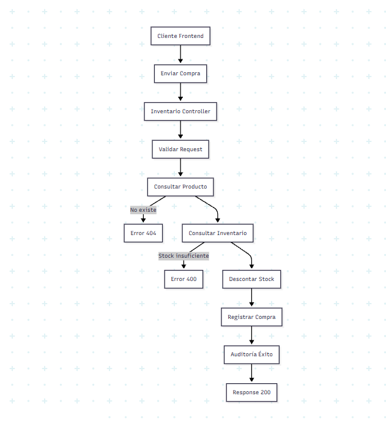
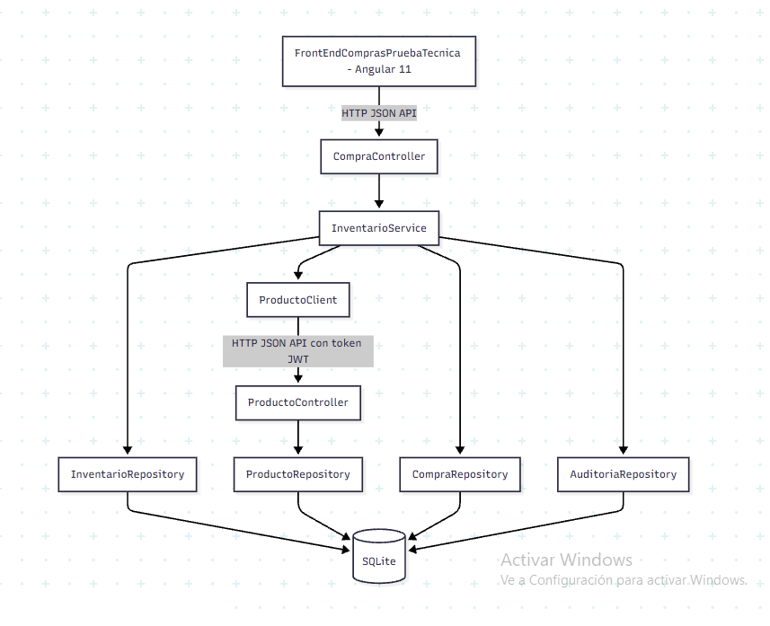

# Entregable Prueba

A partir de los requerimientos definidos en la prueba LinkTIC, se desarrolló una solución enfocada en la correcta separación de responsabilidades, la claridad en la arquitectura y la aplicación de buenas prácticas de desarrollo. Aunque se plantea una arquitectura basada en microservicios, se optó por una implementación con separación lógica dentro de un único backend, lo cual permite simplificar la ejecución y mantener la consistencia del flujo de compra; del mismo modo, se incorporó un frontend en Angular para validar la integración entre componentes. Con lo anterior, la entrega incluye backend, frontend, pruebas, documentación y containerización, presentando una solución funcional, clara y alineada con los objetivos planteados.

### ANÁLISIS FUNCIONAL DEL PROYECTO

#### Objetivo

Implementar un sistema de compras basado en dos microservicios lógicos:

Productos

Inventario

### DECISIÓN ARQUITECTÓNICA CLAVE
¿Dónde vive el endpoint de compra?

InventarioService

#### Justificación técnica:

El inventario es el dueño de la cantidad

La compra modifica stock

Se evita acoplar lógica de negocio en Productos

Se cumple Single Responsibility Principle

Se mantiene consistencia transaccional

### DIAGRAMA FUNCIONAL – FLUJO DE COMPRA

### DIAGRAMA TÉCNICO FRONT → BACK → DB

### ESTÁNDAR DTO – JSON:API
Request Compra
{
"data": {
"type": "compra",
"attributes": {
"productoId": 1,
"cantidad": 2
}
}
}

### Response Compra Exitosa
{
"data": {
"type": "compra",
"id": "10",
"attributes": {
"productoId": 1,
"cantidad": 2,
"total": 20000
}
}
}

### MODELO LÓGICO DE DATOS

#### Entidades:
##### Microservicio

Producto

##### Microservicio
Inventario

Compra

Auditoria

### Autenticacion Backend Compras - Seguridad JWT + RSA

Este proyecto implementa un sistema de compras con **autenticación y autorización** mediante **JWT (JSON Web Token)** y **Spring Security**. Se utilizó **RSA** para firmar y validar los tokens, asegurando que solo usuarios autenticados puedan acceder a ciertas rutas.

#### 1. Seguridad con JWT + RSA

Se implementó la autenticación utilizando **JWT firmado con claves RSA**, con las siguientes características:

- **Generación de token:**  
  Cuando un usuario inicia sesión con su `username` y `password`, se valida contra la base de datos. Si es correcto, se genera un JWT firmado con la **clave privada RSA** (`private_key.pem`) que contiene los datos del usuario y su rol.

- **Validación de token:**  
  Cada solicitud a rutas protegidas incluye el token en el encabezado `Authorization: Bearer <token>`. Spring Security valida el token utilizando la **clave pública RSA** (`public_key.pem`) para asegurar que no haya sido modificado.

- **Roles y autorizaciones:**  
  Dependiendo del `role` del usuario (`ROLE_ADMIN`, `ROLE_USER`, etc.), se permite o deniega el acceso a ciertos endpoints.

### Pruebas Implementadas

En este proyecto se realizaron pruebas unitarias y de integración para asegurar el correcto funcionamiento del microservicio BackEndCompras, enfocado en la validación de productos y gestión de inventario.

#### Pruebas de Validación de Producto

se verifico que el manejo de la existencia del producto solicitado en la compra.

### Escenarios probados:

Producto existente y con datos válidos.

Producto inexistente (el microservicio de productos devuelve data=null o error).

#### Resultado esperado:

Si el producto existe, se procede con la compra.

Si no existe, se lanza un BusinessException con el mensaje "El producto no existe".

#### Pruebas de Inventario

Se garantizo que la compra solo se ejecute si hay suficiente stock disponible.

#### Escenarios probados:

Cantidad solicitada menor o igual al stock disponible → la compra se realiza exitosamente.

Cantidad solicitada mayor al stock disponible → se lanza un BusinessException con el mensaje "Stock insuficiente".

#### Resultado esperado:

El inventario se actualiza correctamente después de una compra exitosa.

La compra es rechazada cuando no hay suficiente stock.

### Pruebas de Producto No Encontrado en Inventario

se valido que el sistema detecte si un producto existe en la base de datos de productos, pero no tiene registro en inventario.

### Escenarios probados:

Producto válido, pero no existe en la tabla de inventario.

### Resultado esperado:

Se lanza un BusinessException con el mensaje "El producto no existe en inventario".

## DOCKERIZACION
### 1. Build docker images
docker build -t backend-compras ./BackEndComprasPruebaTecnica
docker build -t backend-productos ./BackEndProductosPruebaTecnica

### 2. Guardar imagen como tar (opcional)
docker save backend-compras -o backend-compras.tar
docker save backend-productos -o backend-productos.tar

### 3. Ejecutar contenedores (con red y volumen)
docker run -d --name backend-productos --network compras-network -v $(pwd)/productos.db:/app/productos.db -p 8026:8026 backend-productos
docker run -d --name backend-compras --network compras-network -v $(pwd)/compras.db:/app/compras.db -p 8025:8025 backend-compras

### Versionamiento GIT
#### Versionamiento Backend Compras

lo primero que vamos a realizar es clonar el repositorio
comparto la url del repositorio https://github.com/ceanpatni/BackEndComprasPruebaTecnica.git
para bajar los cambios al local
1) git clone --single-branch -b developAndres https://github.com/ceanpatni/BackEndComprasPruebaTecnica.git
#### Versionamiento Backend Productos
para bajar los cambios al local
git clone --single-branch -b developAndres https://github.com/ceanpatni/BackEndProductosPruebaTecnica.git

#### Versionamiento Frontend
para bajar en local
1) git clone --single-branch -b developFrontAndres https://github.com/ceanpatni/FrontEndComprasPruebaTecnica.git

